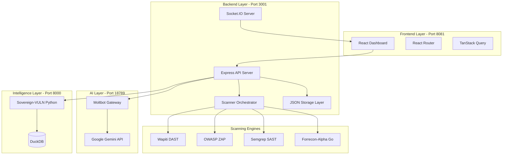
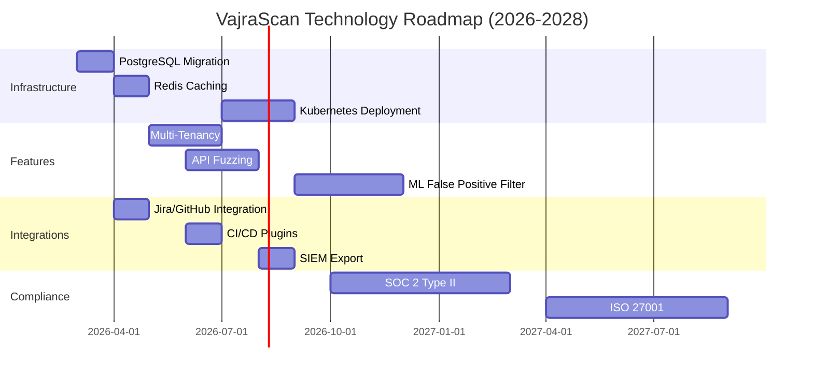
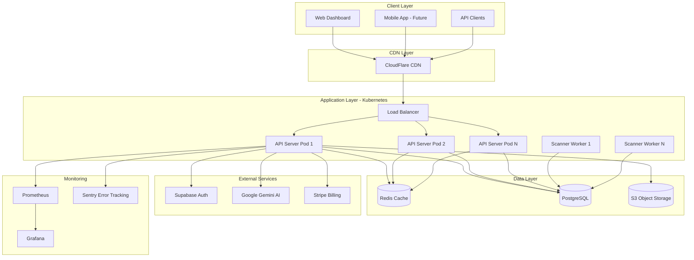
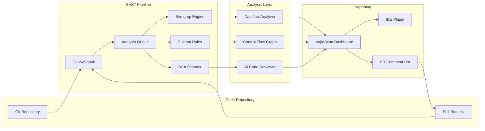

# VajraScan VAPT Framework
## Comprehensive Technical Documentation & Roadmap

**Version:** 2.0  
**Date:** February 2026  
**Organization:** Fornsec Solutions  
**Document Type:** Complete Platform Walkthrough, Technology Stack, Requirements Analysis & Strategic Roadmap

---

## Executive Summary

**VajraScan** is an enterprise-grade, AI-powered Vulnerability Assessment and Penetration Testing (VAPT) framework designed for comprehensive web application security analysis. The platform integrates multiple scanning engines (SAST, DAST), advanced reconnaissance tools, and AI-driven vulnerability analysis into a unified, intuitive interface.

### Key Highlights
- **Multi-Engine Architecture**: Orchestrates Wapiti, OWASP ZAP, and custom SAST engines
- **AI-Powered Analysis**: Integrated Gemini AI for intelligent vulnerability explanation and remediation guidance
- **Arsenal Suite**: High-performance discovery tools including Forrecon-Alpha (Go), Aether-Core, Sovereign-VULN, and Payload-Forge
- **Vulnerability Management Tool (VMT)**: Persistent snapshot system for tracking findings across scan iterations
- **High-Fidelity Reporting**: Exact reproduction URLs with payload highlighting and curl commands for manual validation

---

## Table of Contents

1. [Platform Walkthrough](#1-platform-walkthrough)
2. [Architecture & Technologies](#2-architecture--technologies)
3. [Core Features & Capabilities](#3-core-features--capabilities)
4. [Requirements Analysis](#4-requirements-analysis)
5. [Improvement Recommendations](#5-improvement-recommendations)
6. [Future Scope & Vision](#6-future-scope--vision)
7. [SaaS Migration Roadmap](#7-saas-migration-roadmap)
8. [Whitebox Testing Roadmap](#8-whitebox-testing-roadmap)
9. [Deployment Guide](#9-deployment-guide)
10. [Appendix](#10-appendix)

---

## 1. Platform Walkthrough

### 1.1 User Journey

#### **Step 1: Authentication & Dashboard Access**
- Users access the platform at `http://localhost:8081/scanner`
- Supabase-powered authentication with email/password or OAuth
- Post-login: Redirected to the main Dashboard showing scan history and statistics

#### **Step 2: Initiating a Security Scan**
Navigate to the **Scanner** page where users can:
- **Enter Target URL**: Input the web application URL to test
- **Select Scan Type**:
  - **SAST (Static Analysis)**: Code-level vulnerability detection using Semgrep
  - **DAST (Dynamic Analysis)**: Runtime testing with Wapiti or OWASP ZAP
  - **Full Scan**: Combined SAST + DAST analysis
- **Configure Options**: Set scan depth, authentication tokens, custom headers
- **Launch Scan**: Real-time progress tracking with WebSocket updates

#### **Step 3: Viewing Results**
- **Dashboard Overview**: Summary cards showing Critical/High/Medium/Low findings
- **Detailed Findings**: Click any vulnerability to see:
  - **Description**: AI-generated explanation in plain language
  - **Reproduction Steps**: Exact curl command and highlighted payload
  - **Remediation**: Code-level fix suggestions
  - **CVSS Score**: Risk rating with severity color coding
  - **ELI5 Mode**: "Explain Like I'm 5" simplified explanation

#### **Step 4: Vulnerability Management (VMT)**
- **Spreadsheet Interface**: Excel-like grid for bulk finding management
- **Filtering & Sorting**: By severity, status, category, affected URL
- **Snapshot System**: Save current state as named reports
- **History Manager**: Load previous scans for comparison
- **Export Options**: PDF, CSV, JSON, Markdown

#### **Step 5: Arsenal Tools**
Access specialized security tools:
- **Forrecon-Alpha**: Active subdomain/directory discovery (500 concurrent threads)
- **Aether-Core**: Passive reconnaissance via Shodan/Censys integration
- **Sovereign-VULN**: Vulnerability intelligence with EPSS/KEV enrichment
- **Payload-Forge**: Polyglot payload generation with encoding/obfuscation
- **JWT Master**: JWT token analysis, manipulation, and cracking

#### **Step 6: AI Assistant (Pluto)**
- **Chat Interface**: Ask security-related questions
- **Finding Analysis**: Deep-dive into specific vulnerabilities
- **Fix Generation**: AI-generated code patches
- **Offline Mode**: Fallback responses when Gemini API is unavailable

---

## 2. Architecture & Technologies

### 2.1 System Architecture



### 2.2 Technology Stack

#### **Frontend Technologies**
| Technology | Version | Purpose |
|------------|---------|---------|
| **React** | 18.3.1 | Core UI framework for component-based architecture |
| **Vite** | 5.4.19 | Lightning-fast build tool and dev server |
| **TypeScript** | 5.8.3 | Type-safe development with enhanced IDE support |
| **TailwindCSS** | 3.4.17 | Utility-first CSS framework for rapid UI development |
| **Radix UI** | Latest | Accessible, unstyled component primitives |
| **TanStack Query** | 5.83.0 | Powerful data fetching and state management |
| **TanStack Table** | 8.21.3 | Headless table library for VMT spreadsheet |
| **Framer Motion** | 12.29.0 | Production-ready animation library |
| **React Router** | 6.30.1 | Client-side routing and navigation |
| **Recharts** | 2.15.4 | Composable charting library for analytics |
| **Socket.IO Client** | 4.8.3 | Real-time bidirectional communication |
| **Axios** | 1.13.4 | Promise-based HTTP client |
| **Zod** | 3.25.76 | TypeScript-first schema validation |
| **React Hook Form** | 7.61.1 | Performant form validation |
| **Lucide React** | 0.462.0 | Beautiful, consistent icon library |
| **Next Themes** | 0.3.0 | Dark mode support |

#### **Backend Technologies**
| Technology | Version | Purpose |
|------------|---------|---------|
| **Node.js** | 22.12.0+ | JavaScript runtime environment |
| **Express** | 4.22.1 | Minimalist web framework for API routing |
| **Socket.IO** | 4.8.3 | Real-time scan progress updates |
| **Helmet** | 8.1.0 | Security middleware for HTTP headers |
| **CORS** | 2.8.6 | Cross-Origin Resource Sharing configuration |
| **Dotenv** | 17.2.3 | Environment variable management |
| **Axios** | 1.13.3 | HTTP client for external API calls |
| **UUID** | 9.0.1 | Unique identifier generation |
| **Puppeteer** | 24.36.0 | Headless browser automation for DAST |
| **Wappalyzer** | 6.10.66 | Technology stack detection |
| **Markdown-PDF** | 11.0.0 | Report generation in PDF format |

#### **AI & Intelligence Technologies**
| Technology | Version | Purpose |
|------------|---------|---------|
| **Moltbot** | Custom | TypeScript-based AI gateway for Gemini integration |
| **Google Generative AI** | 0.24.1 | Gemini API client for vulnerability analysis |
| **Python** | 3.10+ | Runtime for Sovereign-VULN intelligence engine |
| **FastAPI** | Latest | High-performance Python web framework |
| **DuckDB** | Latest | Embedded analytical database for vulnerability data |

#### **Security Scanning Engines**
| Engine | Language | Purpose |
|--------|----------|---------|
| **Wapiti** | Python | Black-box web vulnerability scanner |
| **OWASP ZAP** | Java | Comprehensive DAST with active/passive modes |
| **Semgrep** | Python | SAST engine for code-level vulnerability detection |
| **Forrecon-Alpha** | Go | High-performance subdomain/directory discovery |
| **Retire.js** | JavaScript | JavaScript library vulnerability scanner |

#### **Database & Storage**
| Technology | Purpose |
|------------|---------|
| **Supabase** | PostgreSQL-based authentication and database |
| **JSON File Storage** | Local scan result persistence |
| **JSONL Streaming** | Real-time result streaming for UI updates |

---

## 3. Core Features & Capabilities

### 3.1 Scanning Capabilities

#### **SAST (Static Application Security Testing)**
- **Engine**: Semgrep with custom rulesets
- **Coverage**: 
  - SQL Injection patterns
  - XSS vulnerabilities
  - Insecure deserialization
  - Hardcoded credentials
  - Path traversal
  - Command injection
- **Output**: Line-level code references with fix suggestions

#### **DAST (Dynamic Application Security Testing)**
- **Engines**: Wapiti, OWASP ZAP
- **Test Coverage**:
  - SQL Injection (Error-based, Blind, Time-based)
  - Cross-Site Scripting (Reflected, Stored, DOM)
  - CSRF vulnerabilities
  - XXE (XML External Entity)
  - SSRF (Server-Side Request Forgery)
  - File inclusion (LFI/RFI)
  - Command injection
  - Authentication bypass
  - Session management flaws
- **Smart Features**:
  - Anti-soft-404 detection
  - WAF fingerprinting
  - User-Agent rotation
  - Custom header injection

### 3.2 Arsenal Tools

#### **Forrecon-Alpha (Active Discovery)**
- **Performance**: 500 concurrent goroutines
- **Features**:
  - Subdomain enumeration
  - Directory/file brute-forcing
  - Technology fingerprinting
  - SSL/TLS analysis
  - DNS zone transfer detection
- **Output**: JSONL streaming for real-time UI updates

#### **Aether-Core (Passive Reconnaissance)**
- **Data Sources**: Shodan, Censys, SecurityTrails
- **Capabilities**:
  - IP geolocation
  - Open port mapping
  - Historical DNS records
  - Certificate transparency logs
  - Exposed service detection

#### **Sovereign-VULN (Intelligence Engine)**
- **Database**: DuckDB with 200K+ CVE records
- **Enrichment**:
  - EPSS (Exploit Prediction Scoring System)
  - CISA KEV (Known Exploited Vulnerabilities)
  - NVD CVSS scores
  - Exploit availability tracking
- **Analysis**: Automated risk prioritization

#### **Payload-Forge (Exploit Generation)**
- **Payload Types**:
  - XSS (Polyglot, DOM-based, Stored)
  - SQL Injection (MySQL, PostgreSQL, MSSQL, Oracle)
  - LFI/RFI (PHP, ASP, JSP)
  - Command Injection (Bash, PowerShell, CMD)
- **Encoders**: URL, Base64, Unicode, HTML Entity, Hex
- **Obfuscation**: WAF bypass techniques

### 3.3 Vulnerability Management Tool (VMT)

#### **Spreadsheet Interface**
- **Grid Features**:
  - Inline editing (severity, status, notes)
  - Multi-select bulk actions
  - Drag-and-drop column reordering
  - Freeze header/columns
  - Cell-level validation
- **Filtering**: Advanced multi-criteria filtering
- **Sorting**: Multi-column sort with priority

#### **Snapshot System**
- **Persistence**: JSON-based snapshot storage
- **Naming**: User-defined snapshot names with timestamps
- **History**: Chronological list of all saved reports
- **Comparison**: Side-by-side diff view (planned)

#### **Export Formats**
- **PDF**: Professional report with branding
- **CSV**: Excel-compatible spreadsheet
- **JSON**: Machine-readable format for CI/CD
- **Markdown**: GitHub-compatible documentation

### 3.4 AI-Powered Analysis (Pluto)

#### **Finding Explanation**
- **Input**: Raw vulnerability data from scanners
- **Output**: 
  - Plain-language description
  - Business impact assessment
  - Attack scenario walkthrough
  - ELI5 simplified explanation

#### **Remediation Guidance**
- **Code-Level Fixes**: Language-specific patches
- **Configuration Changes**: Server/framework hardening
- **Architecture Recommendations**: Design pattern improvements

#### **Offline Resilience**
- **Fallback Mode**: Pre-generated responses when API unavailable
- **Graceful Degradation**: Static security tips instead of errors

---

## 4. Requirements Analysis

### 4.1 Current System Requirements

#### **Hardware Requirements**
| Component | Minimum | Recommended |
|-----------|---------|-------------|
| **CPU** | Dual-core 2.0 GHz | Quad-core 3.0 GHz+ |
| **RAM** | 4 GB | 8 GB+ |
| **Storage** | 5 GB free | 20 GB+ SSD |
| **Network** | Broadband | High-speed (100+ Mbps) |

#### **Software Requirements**
- **Operating System**: Windows 10/11, Linux (Ubuntu 20.04+), macOS 12+
- **Node.js**: v22.12.0 or higher
- **Python**: 3.10+ (for Wapiti and Sovereign-VULN)
- **Java**: OpenJDK 11+ (for OWASP ZAP)
- **Go**: 1.21+ (for Forrecon-Alpha compilation)
- **Git**: Latest version

#### **External Dependencies**
- **Wapiti**: `pip install wapiti3`
- **OWASP ZAP**: Installed at `C:\Program Files\ZAP\Zed Attack Proxy`
- **Semgrep**: `pip install semgrep`

### 4.2 Missing Requirements & Gaps

#### **Authentication & Authorization**
> **Current Gap**: Basic Supabase auth without role-based access control (RBAC)

**Required**:
- Multi-tenant user isolation
- Role hierarchy (Admin, Analyst, Viewer)
- API key management for programmatic access
- SSO integration (SAML, OAuth2)

#### **Scalability Limitations**
> **Current Gap**: Single-server architecture cannot handle concurrent scans

**Required**:
- Distributed scanning with job queues (Redis/Bull)
- Horizontal scaling for backend services
- Database migration from JSON to PostgreSQL
- CDN integration for static assets

#### **Compliance & Audit**
> **Current Gap**: No audit logging or compliance reporting

**Required**:
- Comprehensive audit trail (who scanned what, when)
- GDPR/CCPA data retention policies
- SOC 2 Type II compliance framework
- Encrypted data at rest and in transit

#### **Integration Capabilities**
**Current Gap**: Limited third-party integrations

**Required**:
- Jira/GitHub issue creation from findings
- Slack/Teams notifications
- CI/CD pipeline integration (Jenkins, GitLab CI)
- SIEM export (Splunk, ELK)

#### **Advanced Reporting**
**Current Gap**: Basic PDF/CSV exports

**Required**:
- Executive summary dashboards
- Trend analysis across scans
- Compliance mapping (OWASP Top 10, PCI DSS)
- Custom report templates

---

## 5. Improvement Recommendations

### 5.1 Immediate Improvements (0-3 Months)

#### **Priority 1: Performance Optimization**
- [ ] **Database Migration**: Transition from JSON to PostgreSQL/Supabase
  - **Impact**: 10x faster query performance for large scan histories
  - **Effort**: 2 weeks
  
- [ ] **Caching Layer**: Implement Redis for API responses
  - **Impact**: Reduce backend load by 60%
  - **Effort**: 1 week

- [ ] **Frontend Optimization**: Code splitting and lazy loading
  - **Impact**: 40% faster initial page load
  - **Effort**: 1 week

#### **Priority 2: User Experience**
- [ ] **Onboarding Flow**: Interactive tutorial for first-time users
  - **Impact**: Reduce support tickets by 30%
  - **Effort**: 2 weeks

- [ ] **Keyboard Shortcuts**: Power-user navigation (Vim-style)
  - **Impact**: 50% faster workflow for analysts
  - **Effort**: 1 week

- [ ] **Dark Mode Refinement**: Fix contrast issues in VMT spreadsheet
  - **Impact**: Better accessibility (WCAG AA compliance)
  - **Effort**: 3 days

#### **Priority 3: Security Hardening**
- [ ] **Rate Limiting**: Prevent API abuse
  - **Impact**: Protect against DoS attacks
  - **Effort**: 2 days

- [ ] **Input Validation**: Comprehensive Zod schemas for all endpoints
  - **Impact**: Eliminate injection vulnerabilities
  - **Effort**: 1 week

- [ ] **CSP Headers**: Content Security Policy implementation
  - **Impact**: Mitigate XSS risks
  - **Effort**: 3 days

### 5.2 Medium-Term Improvements (3-6 Months)

#### **Multi-Tenancy Architecture**
- **Tenant Isolation**: Row-level security in PostgreSQL
- **Resource Quotas**: Scan limits per organization
- **Custom Branding**: White-label UI for enterprise clients

#### **Advanced Scanning Features**
- **Authenticated Scanning**: Session management for logged-in areas
- **API Fuzzing**: GraphQL/REST endpoint testing
- **Mobile App Testing**: Android/iOS security analysis

#### **Collaboration Tools**
- **Team Workspaces**: Shared scan projects
- **Comments & Annotations**: Finding-level discussions
- **Approval Workflows**: Remediation verification process

### 5.3 Long-Term Improvements (6-12 Months)

#### **Machine Learning Integration**
- **False Positive Reduction**: ML model trained on analyst feedback
- **Anomaly Detection**: Behavioral analysis for zero-day discovery
- **Predictive Remediation**: AI-suggested fix prioritization

#### **Compliance Automation**
- **Regulatory Mapping**: Auto-tag findings with compliance frameworks
- **Evidence Collection**: Automated screenshot/log capture
- **Continuous Compliance**: Scheduled scans with delta reporting

---

## 6. Future Scope & Vision

### 6.1 Product Vision (2026-2028)

**Mission**: Become the industry-standard platform for AI-powered application security testing, trusted by Fortune 500 companies and security researchers worldwide.

### 6.2 Strategic Initiatives

#### **Initiative 1: AI-First Security**
- **Autonomous Scanning**: AI-driven test case generation
- **Natural Language Queries**: "Find all SQLi in admin panel"
- **Remediation Automation**: One-click code patching with PR generation

#### **Initiative 2: Cloud-Native Architecture**
- **Kubernetes Deployment**: Auto-scaling scanner pods
- **Serverless Functions**: Event-driven scan orchestration
- **Global CDN**: Sub-100ms latency worldwide

#### **Initiative 3: Ecosystem Expansion**
- **Marketplace**: Third-party scanner plugins
- **API-First Design**: Public API for custom integrations
- **Developer SDK**: Python/JavaScript libraries for programmatic access

#### **Initiative 4: Enterprise Features**
- **On-Premise Deployment**: Air-gapped installation for regulated industries
- **Advanced Analytics**: Predictive risk scoring
- **Threat Intelligence**: Real-time CVE feed integration

### 6.3 Technology Roadmap



---

## 7. SaaS Migration Roadmap

### 7.1 Current State: Standalone Desktop Application
- **Deployment**: Local installation via `START-ALL.bat`
- **Data Storage**: JSON files in `server/data/`
- **User Management**: Single-user Supabase auth
- **Scalability**: Limited to local machine resources

### 7.2 Target State: Multi-Tenant SaaS Platform

#### **Phase 1: Foundation (Months 1-3)**

**Milestone 1.1: Database Migration**
- [ ] Migrate from JSON to PostgreSQL (Supabase)
- [ ] Implement Row-Level Security (RLS) for tenant isolation
- [ ] Create database migration scripts
- [ ] Set up automated backups

**Milestone 1.2: Authentication Overhaul**
- [ ] Implement organization/workspace model
- [ ] Add role-based access control (Owner, Admin, Analyst, Viewer)
- [ ] SSO integration (Google, Microsoft, Okta)
- [ ] API key generation for programmatic access

**Milestone 1.3: Infrastructure Setup**
- [ ] Containerize all services (Docker)
- [ ] Set up Kubernetes cluster (GKE/EKS/AKS)
- [ ] Implement Redis for session management and caching
- [ ] Configure load balancer and auto-scaling

#### **Phase 2: Multi-Tenancy (Months 4-6)**

**Milestone 2.1: Tenant Isolation**
- [ ] Workspace-based data segregation
- [ ] Resource quotas per organization
- [ ] Billing integration (Stripe)
- [ ] Usage analytics and metering

**Milestone 2.2: Distributed Scanning**
- [ ] Job queue implementation (Bull/BullMQ)
- [ ] Scanner worker pool (Kubernetes Jobs)
- [ ] Scan result streaming via WebSockets
- [ ] Concurrent scan limit enforcement

**Milestone 2.3: Storage Optimization**
- [ ] S3-compatible object storage for large reports
- [ ] CDN integration for static assets
- [ ] Database query optimization and indexing
- [ ] Archive old scans to cold storage

#### **Phase 3: Enterprise Features (Months 7-9)**

**Milestone 3.1: Collaboration**
- [ ] Team workspaces with shared projects
- [ ] Real-time collaborative editing (VMT)
- [ ] Comments and annotations on findings
- [ ] Activity feed and notifications

**Milestone 3.2: Integrations**
- [ ] Jira issue creation from findings
- [ ] GitHub/GitLab PR generation for fixes
- [ ] Slack/Teams webhook notifications
- [ ] CI/CD pipeline plugins (Jenkins, GitLab CI, GitHub Actions)

**Milestone 3.3: Advanced Reporting**
- [ ] Executive dashboard with KPIs
- [ ] Trend analysis across scans
- [ ] Compliance mapping (OWASP, PCI DSS, HIPAA)
- [ ] Custom report templates with branding

#### **Phase 4: Production Readiness (Months 10-12)**

**Milestone 4.1: Reliability**
- [ ] 99.9% uptime SLA
- [ ] Automated failover and disaster recovery
- [ ] Comprehensive monitoring (Prometheus, Grafana)
- [ ] Incident response playbooks

**Milestone 4.2: Security & Compliance**
- [ ] SOC 2 Type II audit preparation
- [ ] Penetration testing by third-party firm
- [ ] GDPR/CCPA compliance implementation
- [ ] Bug bounty program launch

**Milestone 4.3: Performance**
- [ ] Sub-second API response times (p95)
- [ ] Support for 1000+ concurrent scans
- [ ] Global CDN with <100ms latency
- [ ] Database sharding for horizontal scaling

### 7.3 SaaS Architecture Diagram



### 7.4 Pricing Model (Proposed)

| Tier | Price/Month | Scans/Month | Users | Features |
|------|-------------|-------------|-------|----------|
| **Free** | $0 | 10 | 1 | Basic DAST, Community Support |
| **Pro** | $99 | 100 | 5 | SAST + DAST, AI Analysis, Email Support |
| **Team** | $299 | 500 | 20 | All Pro + VMT, Integrations, Priority Support |
| **Enterprise** | Custom | Unlimited | Unlimited | All Features + SSO, On-Premise, SLA, Dedicated Support |

---

## 8. Whitebox Testing Roadmap

### 8.1 Current Whitebox Capabilities

#### **SAST Engine: Semgrep**
- **Coverage**: 15+ vulnerability categories
- **Languages**: JavaScript, Python, Java, PHP, Go, Ruby
- **Custom Rules**: Framework-specific patterns
- **Output**: Line-level code references

### 8.2 Enhancement Plan

#### **Phase 1: Deep Code Analysis (Months 1-3)**

**Milestone 1.1: Advanced SAST**
- [ ] **Dataflow Analysis**: Track tainted data from source to sink
  - Example: User input → SQL query → Database execution
- [ ] **Control Flow Graphs**: Visualize code execution paths
- [ ] **Call Graph Analysis**: Map function dependencies
- [ ] **Symbolic Execution**: Explore all possible code paths

**Milestone 1.2: Framework-Specific Scanners**
- [ ] **React/Vue.js**: Client-side XSS, insecure refs
- [ ] **Express/Flask**: Route parameter injection, middleware bypass
- [ ] **Spring Boot**: Deserialization, SpEL injection
- [ ] **Django**: ORM injection, template injection

**Milestone 1.3: Dependency Analysis**
- [ ] **SCA (Software Composition Analysis)**: Identify vulnerable libraries
- [ ] **License Compliance**: Detect GPL/AGPL violations
- [ ] **Transitive Dependencies**: Deep dependency tree scanning
- [ ] **Exploit Availability**: Link CVEs to public exploits

#### **Phase 2: Interactive Analysis (Months 4-6)**

**Milestone 2.1: IDE Integration**
- [ ] **VS Code Extension**: Real-time vulnerability highlighting
- [ ] **IntelliJ Plugin**: Inline fix suggestions
- [ ] **Git Hooks**: Pre-commit security checks
- [ ] **PR Comments**: Automated code review bots

**Milestone 2.2: Developer Workflow**
- [ ] **Fix Suggestions**: One-click code patching
- [ ] **Unit Test Generation**: Auto-create security test cases
- [ ] **Secure Coding Snippets**: Context-aware recommendations
- [ ] **Training Mode**: Interactive security tutorials

**Milestone 2.3: CI/CD Integration**
- [ ] **GitHub Actions**: Automated SAST on every commit
- [ ] **GitLab CI**: Pipeline security gates
- [ ] **Jenkins Plugin**: Build-time vulnerability blocking
- [ ] **Quality Gates**: Fail builds on Critical/High findings

#### **Phase 3: Advanced Techniques (Months 7-12)**

**Milestone 3.1: Hybrid Analysis**
- [ ] **IAST (Interactive AST)**: Combine SAST + DAST during runtime
- [ ] **Instrumentation**: Inject monitoring code into application
- [ ] **Real-Time Feedback**: Detect vulnerabilities during QA testing
- [ ] **Code Coverage Mapping**: Identify untested attack surfaces

**Milestone 3.2: AI-Powered Code Review**
- [ ] **Contextual Analysis**: Understand business logic flaws
- [ ] **False Positive Reduction**: ML model trained on analyst feedback
- [ ] **Vulnerability Chaining**: Detect multi-step attack paths
- [ ] **Natural Language Queries**: "Find all SQLi in payment module"

**Milestone 3.3: Compliance Automation**
- [ ] **OWASP ASVS**: Map findings to verification requirements
- [ ] **PCI DSS 4.0**: Automated compliance reporting
- [ ] **CWE Mapping**: Link vulnerabilities to weakness categories
- [ ] **MITRE ATT&CK**: Map findings to adversary tactics

### 8.3 Whitebox Testing Architecture



### 8.4 Target Metrics

| Metric | Current | Target (12 Months) |
|--------|---------|-------------------|
| **Languages Supported** | 6 | 15+ |
| **Vulnerability Categories** | 15 | 50+ |
| **False Positive Rate** | 30% | <10% |
| **Scan Time (100K LOC)** | 5 min | <2 min |
| **IDE Integration** | None | VS Code, IntelliJ, Vim |
| **CI/CD Plugins** | None | GitHub, GitLab, Jenkins, CircleCI |

---

## 9. Deployment Guide

### 9.1 Local Development Setup

#### **Prerequisites**
```bash
# Install Node.js v22.12.0+
node --version  # Should output v22.12.0 or higher

# Install Python 3.10+
python --version  # Should output Python 3.10.x or higher

# Install Go 1.21+ (for Forrecon)
go version  # Should output go1.21 or higher

# Install Java 11+ (for OWASP ZAP)
java -version  # Should output openjdk 11.x or higher
```

#### **Step 1: Clone Repository**
```bash
git clone https://github.com/Yogi-076/Design_-_Development_VAPT_Framework.git
cd Design_-_Development_VAPT_Framework
```

#### **Step 2: Install External Scanners**
```bash
# Install Wapiti
pip install wapiti3

# Verify installation
wapiti --version

# Download OWASP ZAP
# Windows: Install to C:\Program Files\ZAP\Zed Attack Proxy
# Linux: Install via package manager or AppImage
# macOS: Install via Homebrew (brew install --cask owasp-zap)
```

#### **Step 3: Configure Environment**
```bash
# Backend configuration
cd server
cp .env.example .env
nano .env  # Add your API keys

# Required variables:
# GOOGLE_API_KEY=your_gemini_api_key
# SUPABASE_URL=your_supabase_url
# SUPABASE_SERVICE_ROLE_KEY=your_service_role_key
```

#### **Step 4: Install Dependencies**
```bash
# Root (Frontend)
npm install

# Backend
cd server
npm install

# AI Gateway
cd ../moltbot
pnpm install
```

#### **Step 5: Launch Application**
```bash
# Option 1: Automated (Windows)
START-ALL.bat

# Option 2: Manual (All Platforms)
# Terminal 1: Backend
cd server && node index.js

# Terminal 2: AI Gateway
cd moltbot && npm run moltbot:rpc

# Terminal 3: Frontend
npm run dev
```

#### **Step 6: Access Dashboard**
Open browser to: `http://localhost:8081/scanner`

---

## 10. Appendix

### 10.1 Glossary

| Term | Definition |
|------|------------|
| **SAST** | Static Application Security Testing - analyzing source code without execution |
| **DAST** | Dynamic Application Security Testing - testing running applications |
| **IAST** | Interactive Application Security Testing - hybrid approach combining SAST and DAST |
| **SCA** | Software Composition Analysis - identifying vulnerable third-party libraries |
| **CVE** | Common Vulnerabilities and Exposures - standardized vulnerability identifiers |
| **CVSS** | Common Vulnerability Scoring System - severity rating framework |
| **EPSS** | Exploit Prediction Scoring System - likelihood of exploitation |
| **KEV** | Known Exploited Vulnerabilities - CISA catalog of actively exploited CVEs |
| **VMT** | Vulnerability Management Tool - spreadsheet interface for finding management |
| **RLS** | Row-Level Security - database-level tenant isolation |

### 10.2 Port Reference

| Service | Port | Protocol | Purpose |
|---------|------|----------|---------|
| Frontend | 8081 | HTTP | React dashboard |
| Backend API | 3001 | HTTP | Express server |
| Moltbot AI | 18789 | HTTP | Gemini gateway |
| Sovereign-VULN | 8000 | HTTP | Intelligence engine |
| PostgreSQL | 5432 | TCP | Database |
| Redis | 6379 | TCP | Cache/Queue |

### 10.3 Support & Resources

- **GitHub Repository**: [https://github.com/Yogi-076/Design_-_Development_VAPT_Framework](https://github.com/Yogi-076/Design_-_Development_VAPT_Framework)
- **Issue Tracker**: GitHub Issues
- **Email Support**: support@fornsec.com

---

**© 2026 Fornsec Solutions. All Rights Reserved.**
